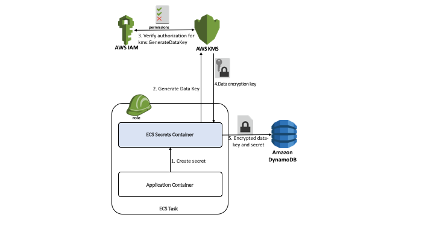
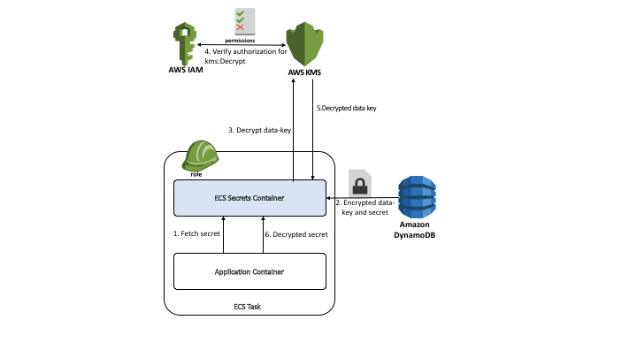

# ECS Secrets - Managing Runtime Secrets for Containers in ECS

Containerized applications frequently need access to sensitive information at
runtime such as API keys, passwords, certificates etc (aka secrets). Handling
such secrets is a challenging and recurring problem for Docker containers. ECS
customers also come up against this issue and there's a need to provide a
mechanism for delivering secrets securely to such containerized applications.

A write-up of various approaches to this problem is summarized in the
["Secrets: write-up best practices, do's and don'ts, roadmap" docker
issue](https://github.com/docker/docker/issues/13490). This issue also outlines
the risks with the following commonly used work-arounds for secrets management:

* Environment Variables: Secrets are easily leaked and unencrypted as secrets
  are visible in docker inspect
* Volumes: Secrets are easily leaked via `volumes-from` and when creating images
  from existing containers
* Building into the container image: Secrets are unencrypted and can be leaked
  easily via build cache or image sharing

The [How to Manage Secrets for Amazon EC2 Container Service–Based Applications 
by Using Amazon S3 and Docker blog](https://blogs.aws.amazon.com/security/post/Tx2B3QUWAA7KOU/How-to-Manage-Secrets-for-Amazon-EC2-Container-Service-Based-Applications-by-Usi)
documents how you could store secrets in an Amazon S3 bucket and use AWS
Identity and Management (IAM) roles to grant access to those stored secrets. The 
[Managing Secrets for Amazon ECS Applications Using Parameter Store and IAM 
Roles for Tasks](https://aws.amazon.com/blogs/compute/managing-secrets-for-amazon-ecs-applications-using-parameter-store-and-iam-roles-for-tasks/)
blog illustrates how the EC2 SSM Parameter Store can be used to do the same. The
`ecs-secrets` tool takes an alternative approach of using the 
AWS Key Management Service (KMS) to encrypt and decrypt secrets stored in 
Amazon DynamoDB service and use IAM roles for ECS Tasks to control access to 
these secrets.

## What is `ecs-secrets`?
`ecs-secrets` provides an out-of-the-box solution for managing and accessing
runtime secrets for containers on ECS. It provides a simple command line
interface and RESTful APIs to create, rotate, fetch and revoke runtime secrets.
It uses DynamoDB to store and retrieve application secret key-value pairs. The
secret payload is encrypted and decrypted using KMS Data Keys. Permissions and
policies to access these secrets can then be set using IAM Users and Roles.

This design helps in addressing the following security goals:

* **Privilege Separation**: Different entities can be authorized to perform
  secret management and secret query. This ensures that applications that read
  secrets can be authorized to just `fetch` secrets while a separate IAM
  user/role is used to create, rotate and revoke secrets
* **Encryption**: Secrets are encrypted at rest in DynamoDB using KMS data keys
  and also in transit using AWS SDK (AWS SDK uses HTTPS by default to ensure
  secrets are encrypted in transit). Even if access is gained to view entries in
  the DynamoDB table, IAM role/user permissions to decrypt using KMS Customer
  Master Key are still needed to view secrets
* **Access Control**: Access to secrets from containers and tasks can be
  controlled using IAM roles
* **Version Control**: Secrets are version controlled. New
  versions of secrets can be registered and existing versions can be revoked

You can interact with `ecs-secrets` using either the CLI or the RESTful
API endpoint. To ensure easy access to IAM role credentials for different
entities managing secrets, and to ensure `Separation of Privilege` between the
same, it's recommended that you incorporate the packaged `amazon/amazon-ecs-secrets`
container into an existing Task Definition as a sidecar and make use of the
RESTful APIs by running it in the daemon mode.

## Getting Started
To use `ecs-secrets`, you can download the `amazon/amazon-ecs-secrets` container
from dockerhub and execute the `setup` command. You can run this from either
your local host or an EC2 Instance as long as you have access to credentials
that let you create a CloudFormation stack with a KMS Master Key and a Dynamo DB
table.

In this example, credentials for an IAM user with administrative privileges 
for an account have been saved in a
[profile named `default`](http://docs.aws.amazon.com/cli/latest/userguide/cli-chap-getting-started.html#cli-multiple-profiles)
to setup `ecs-secrets`:
```bash
$ cat << EOF > setup-env.txt
AWS_REGION=us-west-2
AWS_PROFILE=default
AWS_SHARED_CREDENTIALS_FILE=/root/.aws/credentials
EOF
```
The following command deploys up a Cloudformation stack named `ECS-Secrets-cryptex`,
which creates:

* A DynamoDB table named `ECS-Secrets-cryptex-Secrets`
* A KMS Master Key with alias `ECSSecretsMaskerKey-cryptex` with policies to
  ensure that:
    - Only the `SecretsAdmin` IAM role is allowed to create, rotate and revoke
      secrets
    - Only the `MyApplicationRole` IAM role can be used to fetch secrets

Note that you can use Task IAM roles to grant `access` permissions to
Tasks. You can read more about creating an IAM Role for your Task
[here](http://docs.aws.amazon.com/AmazonECS/latest/developerguide/task-iam-roles.html#create_task_iam_policy_and_role).

```bash
$ docker run --env-file setup-env.txt -v ~/.aws:/root/.aws \
    amazon/amazon-ecs-secrets setup \
    --application-name  cryptex \
    --create-principal arn:aws:iam::123456789012:role/SecretsAdmin \
    --fetch-role arn:aws:iam::123456789012:role/MyApplicationRole

2016-10-29T15:35:06Z [INFO] Unable to describe stack: ECS-Secrets-cryptex, creating a new one
2016-10-29T15:36:23Z [INFO] Secrets are stored in the table: arn:aws:dynamodb:us-west-2:123456789012:table/ECS-Secrets-cryptex-Secrets
2016-10-29T15:36:23Z [INFO] Update 'arn:aws:iam::123456789012:role/MyApplicationRole' to provide read access for this table by updating the policy statement with: {
    "Effect": "Allow",
    "Action": [
       "dynamodb:Query",
       "dynamodb:GetItem"
    ],
    "Resource": [
       "arn:aws:dynamodb:us-west-2:123456789012:table/ECS-Secrets-cryptex-Secrets"
    ]
}
2016-10-29T15:36:23Z [INFO] Update 'arn:aws:iam::123456789012:role/SecretsAdmin' to provide write access for this table by updating the policy statement with: {
    "Effect": "Allow",
    "Action": [
       "dynamodb:PutItem",
       "dynamodb:Query",
       "dynamodb:UpdateItem"
    ],
    "Resource": [
       "arn:aws:dynamodb:us-west-2:123456789012:table/ECS-Secrets-cryptex-Secrets"
    ]
}
2016-10-29T15:36:28Z [INFO] Setup complete
```

Update the write and read policies as per the output of the command. This is **critical** to
provide the necessary permissions to the `admin` and the `application` roles to write and
read secrets from the DynamoDB table.

An example of doing the same from the CLI is provided next:

Example: Updating the `admin` role:
```bash
$ cat << EOF > write-policy.json
{
    "Version": "2012-10-17",
    "Statement" : [{
        "Effect": "Allow",
        "Action": [
            "dynamodb:PutItem",
            "dynamodb:Query",
            "dynamodb:UpdateItem"
        ],
        "Resource": [
            "arn:aws:dynamodb:us-west-2:123456789012:table/ECS-Secrets-cryptex-Secrets"
        ]
    }]
}
EOF

$ aws --region us-west-2 iam create-policy --policy-name ECS-Secrets-cryptex-Secrets-write --policy-document file://write-policy.json
{
    "Policy": {
        "PolicyName": "ECS-Secrets-cryptex-Secrets-write",
        "CreateDate": "...",
        ...
        "Path": "/",
        "Arn": "arn:aws:iam::123456789012:policy/ECS-Secrets-cryptex-Secrets-write",
        "UpdateDate": "..."
    }
}

$ aws --region us-west-2 iam attach-role-policy --role-name SecretsAdmin --policy-arn arn:aws:iam::123456789012:policy/ECS-Secrets-cryptex-Secrets-write
```

Example: Updating the `application` role:
```bash
$ cat << EOF > read-policy.json
{
    "Version": "2012-10-17",
    "Statement" : [{
        "Effect": "Allow",
        "Action": [
            "dynamodb:Query",
            "dynamodb:GetItem"
        ],
    "Resource": [
        "arn:aws:dynamodb:us-west-2:123456789012:table/ECS-Secrets-cryptex-Secrets"
    ]
}]
}
EOF

$ aws --region us-west-2 iam create-policy --policy-name ECS-Secrets-cryptex-Secrets-read --policy-document file://read-policy.json
{
    "Policy": {
        "PolicyName": "ECS-Secrets-cryptex-Secrets-read",
        "CreateDate": "...",
        ...
        "Path": "/",
        "Arn": "arn:aws:iam::123456789012:policy/ECS-Secrets-cryptex-Secrets-read",
        "UpdateDate": "..."
    }
}

$ aws --region us-west-2 iam attach-role-policy --role-name MyApplicationRole --policy-arn arn:aws:iam::123456789012:policy/ECS-Secrets-cryptex-Secrets-read
```

## Creating Secrets
The following diagram illustrates the workflow for creating a secret.
The first step is sending a HTTP POST, containing the secret in the body of the
request to the RESTful endpoint exposed by the `ecs-secrets` container. The
`ecs-secrets` container then invokes the KMS `generate-data-key` API using
IAM Role credentials for the Task [2]. This causes the AWS IAM service to
validate if the IAM Role associated with the task has the relevant permission
to use the KMS `generate-data-key` API [3]. Next, a KMS Data Encryption Key is
returned to the `ecs-secrets` container [4]. This key is used to encrypt the
secret. The encrypted secret and the encrypted data key are then saved in a
DynamoDB table [5].



The following task defintion provides an example of creating a secret using the
`ecs-secrets` container running in daemon mode and an application container
posting a request to create the secret. The task is registered with the the
`arn:aws:iam::123456789012:role/SecretsAdmin` IAM role. This ensures that the
`ecs-secrets` container is authorized to create KMS data encryption keys. The
`create-secrets` container posts the request to create a secret named
`dbpassword` with contents of the file named `password.txt`:
```
{
  "taskRoleArn": "arn:aws:iam::123456789012:role/SecretsAdmin",
  "containerDefinitions": [
    {
      "essential": true,
      "name": "ecs-secrets-daemon",
      "environment": [
        {
          "name": "AWS_REGION",
          "value": "us-west-2"
        }
      ],
      "image": "amazon/amazon-ecs-secrets:latest",
      "command": [
        "daemon",
        "--application-name",
        "cryptex",
        "--debug"
      ],
      "cpu": 25,
      "memoryReservation": 25
    },
    {
      "essential": true,
      "mountPoints": [
        {
          "containerPath": "/secrets",
          "sourceVolume": "secrets",
          "readOnly": true
        }
      ],
      "name": "curl",
      "links": [
        "ecs-secrets-daemon:ecs-secrets"
      ],
      "image": "tutum/curl",
      "command": [
        "curl",
        "-X",
        "POST",
        "-d",
        "@/secrets/password.txt",
        "ecs-secrets:8080/latest/secrets/password"
      ],
      "cpu": 25,
      "memoryReservation": 25
    }
  ],
  "volumes": [
    {
      "host": {
        "sourcePath": "/tmp/secrets"
      },
      "name": "secrets"
    }
  ],
  "family": "ecs-secrets-create"
}
```

On the instance, the password file has the following contents:
```bash
$ cat /tmp/secrets/password.txt
{"payload":"123456"}
```

If you specified an IAM user as argument to `--create-principal` instead of an
IAM role
(Example: `--create-principal arn:aws:iam::123456789012:user/cryptex-admin`),
you can also run the `create` command using the CLI. In the example listed next,
the profile credentials from `cryptex-admin` profile are used to create secrets.
```bash
$ cat << EOF > setup-env.txt
AWS_REGION=us-west-2
AWS_DEFAULT_PROFILE=cryptex-admin
AWS_SHARED_CREDENTIALS_FILE=/root/.aws/credentials
EOF

$ echo "mydbpassword" > secrets.txt

$ docker run --env-file setup-env.txt -v ~/.aws:/root/.aws \
    amazon/amazon-ecs-secrets create \
    --application-name  cryptex \
    --name dbpassword \
    --payload `cat secrets.txt`
```

You can register a new version of the secret key by running the `create` command
again. Note that you can also specify the location of the file that containers
secrets using `--payload-location`. Example:
```bash
$ docker run --env-file setup-env.txt -v ~/.aws:/root/.aws \
    amazon/amazon-ecs-secrets create \
    --application-name  cryptex \
    --name dbpassword \
    --payload-location secret.txt
```

## Retrieving Secrets
The following diagram illustrates the workflow for retrieving secrets from the
secret store. The application container sends a HTTP GET request with the name
of the secret [1] to the `ecs-secrets` container's RESTful endpoint. The
`ecs-secrets` container retrieves encrypted data keys and encrypted
secrets from the DynamoDB table [2]. It then invokes the KMS `decrypt` API to
decrypt the encrypted data key [3].  This causes the AWS IAM service to
validate if the IAM Role associated with the task has the relevant permission
to use the KMS `decrypt` API [4]. The decrypted data key is then used to decrypt
the encrypted secret [6].



The following example illustrates a Task Definition for fetching secrets from
the secret store:
```
{
  "taskRoleArn": "arn:aws:iam::123456789012:role/MyApplicationRole",
  "containerDefinitions": [
    {
      "name": "ecs-secrets-daemon",
      "environment": [
        {
          "name": "AWS_REGION",
          "value": "us-west-2"
        }
      ],
      "image": "amazon/amazon-ecs-secrets:latest",
      "command": [
        "daemon",
        "--application-name",
        "cryptex",
        "--debug"
      ],
      "cpu": 25,
      "memoryReservation": 25,
      "essential": true
    },
    {
      "essential": true,
      "name": "curl",
      "links": [
        "ecs-secrets-daemon:ecs-secrets"
      ],
      "image": "tutum/curl",
      "command": [
        "curl",
        "ecs-secrets:8080/latest/secrets/password"
      ],
      "cpu": 25,
      "memoryReservation": 25
    }
  ],
  "family": "ecs-secrets-fetch"
}
```

On the instance, the output of the `curl` container shows the following:
```bash
$ docker logs 9b8a8495ba99
  % Total    % Received % Xferd  Average Speed   Time    Time     Time  Current
                                 Dload  Upload   Total   Spent    Left  Speed
100    64  100    64    0     0    558      0 --:--:-- --:--:-- --:--:--   566
{"name":"password","serial":1,"payload":"123456","active":true}
```

## Revoking Secrets
`ecs-secrets` also supports versioning of secrets. You can use the `revoke`
command to revoke specific versions of secrets. Example:
```bash
$ docker run --env-file setup-env.txt -v ~/.aws:/root/.aws \
    amazon/amazon-ecs-secrets revoke \
    --application-name cryptex \
    --name dbpassword \
    --serial 1

$ docker run --env-file setup-env.txt -v ~/.aws:/root/.aws \
    amazon/amazon-ecs-secrets fetch \
    --application-name cryptex \
    --name dbpassword \
    --serial 1
{"name":"dbpassword","serial":1,"payload":"","active":false}
```
In the above example, the version `1` of secret named `dbpassword` has been
revoked, because of which, retrieving that version of the secret
using the `fetch` command would not work. Where as, fetching the version 
`2` of the secret returns the appropriate value of the secret.
```bash
$ docker run --env-file setup-env.txt -v ~/.aws:/root/.aws \
    amazon/amazon-ecs-secrets fetch \
    --application-name cryptex \
    --name dbpassword
{"name":"dbpassword","serial":2,"payload":"mydbpassword","active":true}
```

You can also run this within a Task Definition as with all other commands. A
HTTP POST request to the `/revoke` endpoint revokes a secret. A sample task
definition for the same is listed next:

```
{
        "family": "ecs-secrets-demo-revoke",
        "taskRoleArn": "arn:aws:iam::123456789012:role/SecretsAdmin",
        "containerDefinitions": [
            {
                "environment": [
                    {
                        "name": "AWS_DEFAULT_REGION",
                        "value": "us-west-2"
                    },
                ],
                "name": "ecs-secrets",
                "image": "amazon/amazon-ecs-secrets:latest",
                "cpu": 25,
                "memory": 25,
                "command": [
                    "ecs-secrets --application-name cryptex daemon --debug"
                ],
                "essential": true,
            },
            {
                "environment": [
                    {
                        "name": "AWS_DEFAULT_REGION",
                        "value": "us-west-2"
                    }
                ],
                "name": "fetch-secrets",
                "image": "tutum/curl",
                "cpu": 25,
                "entryPoint": [
                    "bash",
                    "-c"
                ],
                "memory": 25,
                "command": [
                    "curl -X POST ecs-secrets:8080/latest/revoke/dbpassword/1"
                ],
                "essential": true,
            }
        ]
}
```

